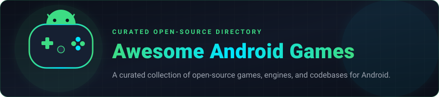

  

  
  <!-- TOTAL_GAMES_COUNT --><!-- /TOTAL_GAMES_COUNT -->
  <!-- LAST_UPDATED --><!-- /LAST_UPDATED -->
  
  
  

  A curated directory of awesome open-source Android games, game engines, and codebases.

---

## Games List

<!-- GAMES_LIST_START -->
### Categories

- [Strategy & 4X](#strategy--4x) (6)
- [Roguelike & RPG](#roguelike--rpg) (13)
- [Sandbox & Simulation](#sandbox--simulation) (3)
- [Puzzle & Board](#puzzle--board) (20)
- [Arcade, Action & Racing](#arcade-action--racing) (11)
- [Casual & Adventure](#casual--adventure) (4)

---

### Strategy & 4X

- **[Unciv](https://github.com/yairm210/Unciv)** — Open-source 4X civilization-building strategy game, inspired by Civ V.
  - `Kotlin / LibGDX` · ⭐ **11.1k** · Last updated: `2026-08-19` · `MPL-2.0`
- **[Freeciv](https://github.com/freeciv/freeciv)** — Turn-based empire-building strategy game inspired by the history of human civilization.
  - `C` · ⭐ **1.6k** · Last updated: `2026-08-19` · `GPL-2.0`
- **[Mindustry](https://github.com/Anuken/Mindustry)** — A sandbox tower-defense factory automation game with endless resource management.
  - `Java / LibGDX` · ⭐ **28.7k** · Last updated: `2026-08-18` · `GPL-3.0`
- **[CPU Defense](https://github.com/ochadenas/cpudefense)** — A tactical tower defense game for Android based on a microprocessor architecture theme.
  - `Kotlin` · ⭐ **201** · Last updated: `2026-08-15` · `MIT`
- **[FeudalTactics](https://github.com/Sesu8642/FeudalTactics)** — Turn-based tactical strategy game with procedurally generated challenges.
  - `Java` · ⭐ **114** · Last updated: `2026-08-10` · `GPL-3.0`
- **[Anuto TD](https://github.com/mjaun/android-anuto)** — A minimalist, tactical tower defense game for Android with clean vector aesthetics.
  - `Kotlin / Java` · ⭐ **238** · Last updated: `2024-09-29` · `GPL-2.0`

### Roguelike & RPG

- **[Remixed Dungeon](https://github.com/NYRDS/remixed-dungeon)** — Traditional roguelike game with enhanced classes, lore, and mods based on Pixel Dungeon.
  - `Java` · ⭐ **285** · Last updated: `2026-08-18` · `GPL-3.0`
- **[Andor's Trail](https://github.com/AndorsTrailRelease/andors-trail)** — A massive, quest-driven, turn-based fantasy RPG set in an open medieval world.
  - `Java` · ⭐ **139** · Last updated: `2026-08-18` · `GPL-2.0`
- **[Magic Ling Pixel Dungeon](https://github.com/LingASDJ/Magic_Ling_Pixel_Dungeon)** — Feature-packed magic-themed roguelike RPG branch of Shattered Pixel Dungeon.
  - `Java / LibGDX` · ⭐ **83** · Last updated: `2026-08-18` · `GPL-3.0`
- **[Shattered Pixel Dungeon](https://github.com/00-Evan/shattered-pixel-dungeon)** — Traditional roguelike dungeon crawler RPG with deep tactical turn-based combat.
  - `Java / LibGDX` · ⭐ **6.4k** · Last updated: `2026-08-15` · `GPL-3.0`
- **[Destination Sol](https://github.com/MovingBlocks/DestinationSol)** — Open-source 2D space action RPG shooter exploring endless procedural solar systems.
  - `Java / LibGDX` · ⭐ **350** · Last updated: `2026-08-14` · `Apache-2.0`
- **[astro-loop](https://github.com/PubDeer/astro-loop)** — Clean open-source roguelike space shooter without ads or tracking.
  - `Kotlin` · ⭐ **67** · Last updated: `2026-08-11` · `GPL-3.0`
- **[Pixel Spacebase](https://github.com/codefitz/Pixel-Spacebase)** — Space-themed sci-fi roguelike RPG based on Shattered Pixel Dungeon.
  - `Java / LibGDX` · ⭐ **11** · Last updated: `2026-06-05` · `GPL-3.0`
- **[DoggyMan3D](https://github.com/0xMartin/DoggyMan3D)** — 3D action RPG adventure game created in Unity for Android.
  - `C# / Unity` · ⭐ **24** · Last updated: `2026-02-16` · `MIT`
- **[Metal Max Remake](https://github.com/MetalMaxRemake/metalmax)** — Remake of the classic Metal Max post-apocalyptic tank RPG on Android using OpenGL ES.
  - `C++ / OpenGL` · ⭐ **17** · Last updated: `2025-12-13` · `MIT`
- **[Rat King Pixel Dungeon 2](https://github.com/Zrp200/rkpd2)** — Popular Shattered Pixel Dungeon fork with enhanced hero abilities and chaotic mechanics.
  - `Java / LibGDX` · ⭐ **45** · Last updated: `2025-06-01` · `GPL-3.0`
- **[VitalSlayer](https://github.com/P8-QS/VitalSlayer)** — Health-driven mobile dungeon crawler using Health Connect on Android.
  - `C# / Unity` · ⭐ **11** · Last updated: `2025-05-27` · `MIT`
- **[Pixel Dungeon](https://github.com/watabou/pixel-dungeon)** — The original legendary pixel-art roguelike RPG for Android.
  - `Java` · ⭐ **3.9k** · Last updated: `2019-07-23` · `GPL-3.0`
- **[Cataclysm: Dark Days Ahead](https://github.com/a1studmuffin/Cataclysm-DDA-Android)** — Turn-based post-apocalyptic survival roguelike ported to Android with touch controls.
  - `C++` · ⭐ **62** · Last updated: `2018-10-15` · `CC-BY-SA-3.0`

### Sandbox & Simulation

- **[Luanti (formerly Minetest)](https://github.com/luanti-org/luanti)** — Infinite-world voxel sandbox game engine featuring modding and multiplayer support on Android.
  - `C++ / Lua` · ⭐ **13.5k** · Last updated: `2026-08-18` · `LGPL-2.1`
- **[OpenTTD](https://github.com/OpenTTD/OpenTTD)** — Open-source transport simulation game based on Transport Tycoon Deluxe.
  - `C++` · ⭐ **8.2k** · Last updated: `2026-08-18` · `GPL-2.0`
- **[GameOfLife](https://github.com/Efimj/GameOfLife)** — Interactive Conway's Game of Life simulation built with Jetpack Compose.
  - `Kotlin / Jetpack Compose` · ⭐ **89** · Last updated: `2026-01-31` · `MIT`

### Puzzle & Board

- **[Braincup](https://github.com/SimonSchubert/Braincup)** — Open-source memory, focus, and math brain training game built with Kotlin Multiplatform.
  - `Kotlin / Compose Multiplatform` · ⭐ **265** · Last updated: `2026-08-18` · `Apache-2.0`
- **[gauguin](https://github.com/meikpiep/gauguin)** — Sudoku-like number puzzle game for Android based on arithmetic logic.
  - `Kotlin` · ⭐ **210** · Last updated: `2026-08-18` · `GPL-3.0`
- **[Puzzle Suite](https://github.com/sidhant947/Puzzle)** — A suite of 270+ minimalist puzzle games built with Flutter for Android.
  - `Dart / Flutter` · ⭐ **199** · Last updated: `2026-08-15` · `GPL-3.0`
- **[Mines3D](https://github.com/stastnypremysl/Mines3D)** — Challenging 3D layered matrix minesweeper game for Android.
  - `Java` · ⭐ **23** · Last updated: `2026-07-22` · `GPL-3.0`
- **[Sopa Word Puzzle](https://github.com/djschilling/sopa)** — Grid-based word search puzzle game with physics-based interactions for Android.
  - `Java` · ⭐ **36** · Last updated: `2026-07-20` · `Apache-2.0`
- **[ROTA](https://github.com/HarmonyHoney/ROTA)** — Gravity-bending block puzzle platformer game built with Godot for Android and PC.
  - `GDScript / Godot` · ⭐ **331** · Last updated: `2026-06-25` · `MIT`
- **[tiny_crate](https://github.com/HarmonyHoney/tiny_crate)** — Crate-chucking puzzle platformer game made with Godot Engine for Android.
  - `GDScript / Godot` · ⭐ **238** · Last updated: `2026-06-25` · `Unlicense`
- **[Klooni1010](https://github.com/LonamiWebs/Klooni1010)** *(Archived)* — Open-source 1010 block puzzle game built with LibGDX for Android.
  - `Java / LibGDX` · ⭐ **245** · Last updated: `2026-02-11` · `GPL-3.0`
- **[15 Puzzle](https://github.com/italankin/15Puzzle)** — Classic sliding 15-number tile puzzle game with customizable themes and animations.
  - `Java` · ⭐ **42** · Last updated: `2025-12-30` · `MIT`
- **[Ultimate Tic Tac Toe](https://github.com/henrykvdb/UltimateTTTAndroid)** — Ultimate 9x9 strategic nested grid Tic-Tac-Toe for Android.
  - `Kotlin` · ⭐ **14** · Last updated: `2025-11-30` · `MIT`
- **[Naija Ludo](https://github.com/mshdabiola/Naijaludo)** — Modern mobile edition of classic Ludo with smooth animations and multiplayer support.
  - `Kotlin` · ⭐ **14** · Last updated: `2025-10-27` · `GPL-3.0`
- **[Tangler](https://github.com/andrzej-nov/Tangler)** — Casual knot untangling puzzle game written in Kotlin for Android and Desktop.
  - `Kotlin` · ⭐ **25** · Last updated: `2025-09-14` · `CC-BY-4.0`
- **[Chain Relations](https://github.com/andrzej-nov/ChainRelations)** — A casual connection and chain puzzle game for Android written in Kotlin.
  - `Kotlin` · ⭐ **12** · Last updated: `2025-09-14` · `CC-BY-4.0`
- **[Antimine](https://github.com/lucasnlm/antimine-android)** — Clean, modern, open-source minesweeper puzzle game with customizable boards.
  - `Kotlin` · ⭐ **786** · Last updated: `2025-08-02` · `GPL-3.0`
- **[UnoCard](https://github.com/shiawasenahikari/UnoCard)** — Open-source UNO card game for Android and PC with AI opponents.
  - `Java` · ⭐ **23** · Last updated: `2025-06-09` · `Apache-2.0`
- **[tripeaks-gdx](https://github.com/mimoguz/tripeaks-gdx)** — Clean TriPeaks solitaire card game built with LibGDX for Android.
  - `Kotlin / LibGDX` · ⭐ **88** · Last updated: `2025-03-15` · `GPL-3.0`
- **[2048 Android](https://github.com/uberspot/2048-android)** — Clean, smooth native Android open-source edition of the viral 2048 puzzle game.
  - `Java / HTML5` · ⭐ **1.1k** · Last updated: `2024-08-11` · `MIT`
- **[Minesweeper Compose](https://github.com/jayasuryat/minesweeper-j-compose)** — Modern, smooth open-source Minesweeper puzzle game built natively with Jetpack Compose.
  - `Kotlin / Jetpack Compose` · ⭐ **102** · Last updated: `2024-07-12` · `Apache-2.0`
- **[DroidFish Chess](https://github.com/peterosterlund2/droidfish)** — Feature-rich open-source chess app for Android, powered by the Stockfish engine.
  - `Java / C++` · ⭐ **429** · Last updated: `2024-06-04` · `GPL-3.0`
- **[Tetris Android](https://github.com/sandwwraith/tetris)** — Classic block puzzle game built with Kotlin and custom Android Views.
  - `Kotlin` · ⭐ **480** · Last updated: `2024-03-12` · `Apache-2.0`

### Arcade, Action & Racing

- **[C-Dogs SDL](https://github.com/cxong/cdogs-sdl)** — Classic overhead run-and-gun arcade shooter with campaign and cooperative multiplayer.
  - `C / SDL` · ⭐ **1.1k** · Last updated: `2026-08-17` · `GPL-2.0`
- **[Ricochlime](https://github.com/adil192/ricochlime)** — Fast-paced, satisfying top-down slime arena monster shooter game for Android.
  - `Dart / Flutter` · ⭐ **163** · Last updated: `2026-08-11` · `AGPL-3.0`
- **[SuperTuxKart](https://github.com/supertuxkart/stk-code)** — 3D open-source arcade kart racing game with multiplayer and vibrant tracks.
  - `C++` · ⭐ **5.3k** · Last updated: `2026-08-01` · `GPL-3.0`
- **[Brick Blast](https://github.com/ashrafimostafa/Brick-Blast)** — Modern arcade brick-breaking game built with Kotlin and Jetpack Compose.
  - `Kotlin / Jetpack Compose` · ⭐ **12** · Last updated: `2026-07-30` · `MIT`
- **[Open Surge](https://github.com/alemart/opensurge)** — 2D retro side-scrolling platformer game inspired by classic 16-bit Sonic games.
  - `C / Allegro` · ⭐ **473** · Last updated: `2026-07-29` · `GPL-3.0`
- **[Vector Pinball](https://github.com/dozingcat/Vector-Pinball)** — Retro vector-graphics arcade pinball game with responsive Box2D physics.
  - `Java / C++` · ⭐ **464** · Last updated: `2026-06-29` · `GPL-3.0`
- **[tails-adventure](https://github.com/mechakotik/tails-adventure)** — Tails Adventure 2D action platformer remade from the ground up for Android and PC.
  - `C++` · ⭐ **144** · Last updated: `2026-06-28` · `GPL-3.0`
- **[alexvsbus](https://github.com/M374LX/alexvsbus)** — Fast-paced platform runner game in which Alex races to catch the bus on time.
  - `C / SDL` · ⭐ **18** · Last updated: `2026-06-03` · `MIT`
- **[retrowars](https://github.com/retrowars/retrowars)** — Multiplayer retro game arcade engine for Android featuring cross-game battles.
  - `Kotlin` · ⭐ **237** · Last updated: `2026-05-27` · `GPL-3.0`
- **[Flappy Bird](https://github.com/VadimBoev/FlappyBird)** — Ultra-lightweight native C open-source clone of Flappy Bird for Android.
  - `C / NDK` · ⭐ **2.4k** · Last updated: `2026-05-17`
- **[Pixel Wheels](https://github.com/agateau/pixelwheels)** — Top-down retro 2D racing game with multiple vehicle classes, weapons, and tracks.
  - `Java / LibGDX` · ⭐ **456** · Last updated: `2026-04-18` · `GPL-3.0`

### Casual & Adventure

- **[UltraStar Play](https://github.com/UltraStar-Deluxe/Play)** — Free and open-source singing rhythm party game with companion app support.
  - `C# / Unity` · ⭐ **499** · Last updated: `2026-06-24` · `MIT`
- **[Run01](https://github.com/is-cout/run01-unity-game)** — 3D endless runner game with fluid obstacle traversal built in Unity.
  - `C# / Unity` · ⭐ **21** · Last updated: `2025-02-21` · `GPL-3.0`
- **[CapybaraAdventure](https://github.com/revenkogrisha/CapybaraAdventure)** — Charming casual capybara adventure runner game for Android.
  - `C# / Unity` · ⭐ **21** · Last updated: `2025-02-11` · `Apache-2.0`
- **[CuboidalDrift](https://github.com/virejdasani/CuboidalDrift)** — Fast-paced casual 3D isometric drifting game built natively for Android.
  - `Java` · ⭐ **32** · Last updated: `2023-03-20` · `MIT`
<!-- GAMES_LIST_END -->

---

## Contributing

Contributions are very welcome! If you know of an awesome open-source Android game that should be on this list:

1. Check that the project is **open-source** and has runnable/buildable code for Android.
2. Edit `games.json` or run `uv run python src/update_stats.py --add <github_repo_url> --desc "..." --tech "..."`.
3. Submit a Pull Request.

Please see [CONTRIBUTING.md](CONTRIBUTING.md) for full guidelines.

---

## License

This repository is dedicated to the public domain under the [Creative Commons Zero v1.0 Universal (CC0 1.0)](LICENSE) license.
